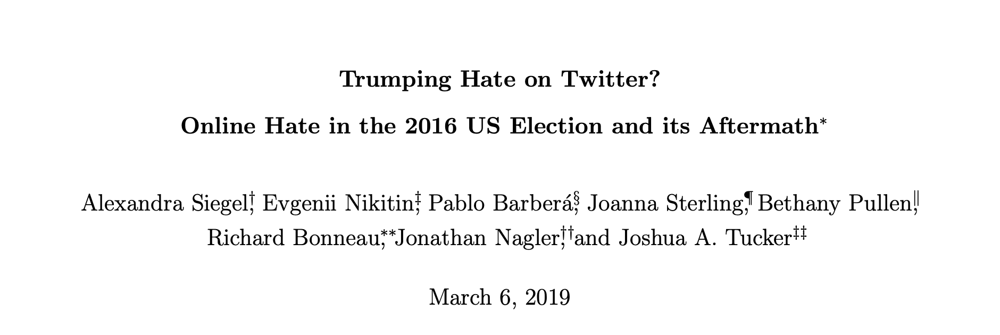
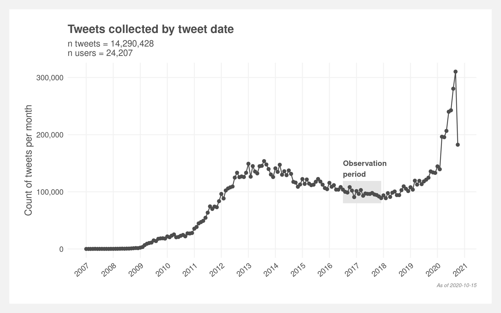

# Inspiration

  

---

## Research Question:

- Expand the methodological framework presented by Seigel et al., 2019 to study hate speech targeted at the LGBTQ+ community. 

- Does the prevalence of LGBTQ+ hate speech in the United States change in accordance with political events?  

### Hypotheses:

1. There is a detectable baseline population level of LGBTQ+ directed hate speech on Twitter. 

2. Hate speech increases immediately following LGBTQ+ relevant events (legalization of marriage, Trans military service executive order) and then returns to a baseline level. 

---

class: inverse, center, middle

# Part I: Sampling

---

# Sampling Goal

### Collect a random sample of United States Twitter users
- Filter out users not located in the **United States**
- For each sampled user, collect all tweets from **June of 2015 through June of 2017**
- To ensure an adequate final sample size, we need approximately **250,000 accounts** 

---

# Sampling Process 

- Obtaining **250,000** users in the United States will require testing 30 million random integers against the Twitter API 
- Per the Twitter API call limits, we can only make **900 API calls every 15 min**
- In order to obtain the sample, estimates suggest we will need **20+ days** of continuous API processing
- To run these days of continuous API calls, we are using a Raspberry Pi
- Based on pilot estimates, the final data set will contain **150 million tweets**

---

class: center, inverse

# Sampling Status

---

# Challenge 1: Sampling Issues

## The Challenge:
- Twitter IDs are currently 64-bit integers so it can be anything from 1 to 9,223,372,036,854,775,807
- Random Sample is computationally unfeasible

## Solution:
- IDs are issued quasi-sequentially and older IDs used to be much smaller
- We can randomly sample from a sample space of 1 to 10,000,000,000 and still get a feasible ‘hit rate’

## Cost:
- Our sample is going to be biased towards users that have older accounts

---
class: inverse, center, middle

# Part II: Identify Hate Speech

---

# Three Stage Model

Hate speech detection follows the framework set out by Seigel et al., 2019

## Stage 1:

- Develop a content dictionary of LGBTQ+ specific hate speech terminology

- Terms and phrases were obtained from [hatebase.org]("https://hatebase.org/), an NGO that documents hate speech terminology

- Currently, content dictionary includes 71 unique terms/phrases

## Stage II:

- Use content dictionary to filter tweet dataset

## Stage III:

- The majority of tweets identified by the content dictionary will not actually be hate speech. In Seigel 2019, 7% of tweets identified actually *condemned* hate speech

- Develop Naive Bayes or RNN model to identify "fasle flags" and actual instances of hate speech. 

---

# Identification Update

## Pilot of ~ 5 million tweets:

- Draft of content dictionary has been created, but iterations are continuing

- The content dictionary flagged .5% of tweets ~ 25000 tweets flagged

- Based on this estimate, we expect to have 750,000 tweets that will be classifed by the machine learning model. 

---

# Challenge 2: Computational Memory

## The Challenge:

- As the number of tweets increases, R/Python memory limitations are reached. 

- The text nature of the data adds additional memory constraints 

## The Solution: 

- Data processing and machine learning model fitting will be done using Spark/Scala

- Spark processes are a distributed computing framework designed to process high volumes of data in parallel. 

---

# Challenge 3: Labeling Tweets

## The Challenge (Part i):

- Building supervised machine learning models requires a labeled 'ground truth' set of responses. In the context of this project, 10,000-25,000 tweets need to be labeled as true instances of hate speech or as a false flag. 

## The Solution (Part i):

- Use MTurk to obtain labeled tweets. 

- Obtaining enough MTurk ratings for would require ~ $1000. We applied for an NYU sponsored grant to help cover MTurk costs. 

- Use Kappa statistic to maximize rating accuracy in an efficient way. 

## The Challenge (Part ii)

- Due to financial uncertainties in higher education, the grant we applied for has been frozen. 

## The Solution (Part ii):

- The research team will manually label as many tweets as possible. 

---

# Project Overview

## An exercise in applied research 

- Grant writing is an essential part of research in Academia

- Sometimes compromises need to be maid in sampling strategies

## Skills we are developing 

- Obtaining real world data directly from the source 

- Using parallel computing frameworks

