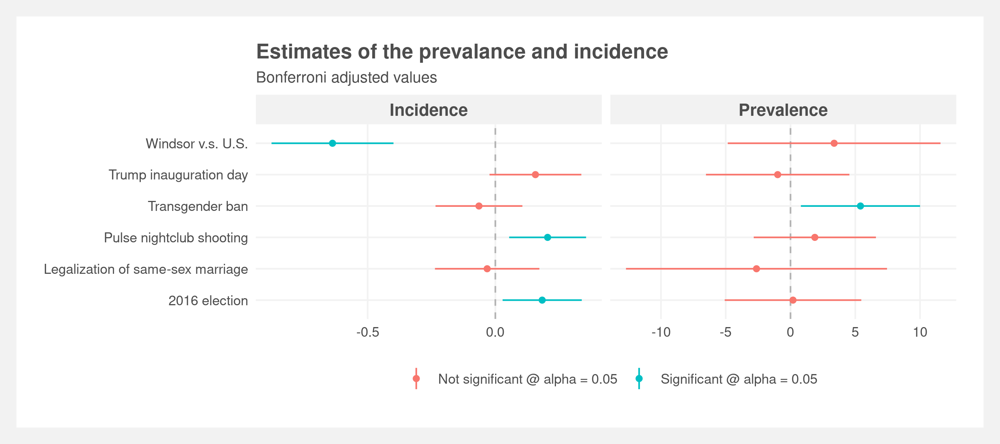

# Detecting hate speech

Final project for NYU Statistical Consulting class.

**Warning: this project contains vulgar and offensive language.**

## Abstract

The divisive and polarizing rhetoric in the 2016 presidential election sparked concern over popularizing hateful sentiments towards marginalized populations on Twitter. In [this paper](https://raw.githubusercontent.com/joemarlo/hate-speech/main/Writeup_and_presentation/LGBTQ%2B%20hate%20speech%20on%20social%20media.pdf), we focus on the LGBTQ+ community and examine ~100 million tweets for the presence of hate speech targeted towards LGBTQ+ Americans as a result of key political and social events related to the LGBTQ+ community. Dictionary-based methods refined by logistic regression, Naive Bayes, and Recurrent Neural Network (RNN) machine learning classifiers were used to identify hate speech. We found no conclusive evidence of changes in prevalence or incidence of hate speech around key events. While some events saw brief upticks in prevalence, overall levels of hate speech remained stable. Our analysis finds exploratory evidence of decreases in prevalence of anti-LGBTQ+ hate speech (p < 0.001) over time coinciding with a Twitter policy change allowing users to directly report abuse.

## Results

