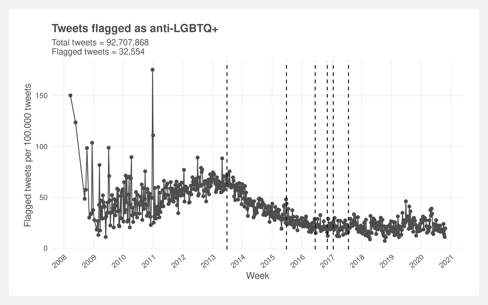

# Detecting hate speech

Final project for NYU Statistical Consulting class.

**Warning: this project contains vulgar and offensive language.**

Read the full paper [here](https://raw.githubusercontent.com/joemarlo/hate-speech/main/Writeup_and_presentation/LGBTQ%2B%20hate%20speech%20on%20social%20media.pdf) and a shortened summary [here](https://www.marlo.works/posts/hate-speech/).

## Abstract

The divisive and polarizing rhetoric in the 2016 presidential election sparked concern over popularizing hateful sentiments towards marginalized populations on Twitter. We analyzed ~100 million tweets spanning 14 years to identify hate speech targeted towards the LGBTQ+ community. We then modeled the prevalence and incidence of hate speech surrounding key political events to test if there was a significant change in the patterns.

Hate speech was identified using dictionary-based methods refined by logistic regression, Naive Bayes, and Recurrent Neural Network (RNN) machine learning classifiers. Quasi-experimental interrupted time series design was used to quantify the incidence and prevalence of hate speech — the former defined as the change in rate of hate speech and the latter the change in the amount of hate speech in a given time period.

We found no conclusive evidence of changes in prevalence or incidence of hate speech around key events. While some events saw brief upticks in prevalence, overall levels of hate speech remained stable. Our analysis finds exploratory evidence of decreases in incidence of anti-LGBTQ+ hate speech (p < 0.001) over time coinciding with a [Twitter policy change](https://blog.twitter.com/official/en_us/a/2013/keep-up-with-conversations-on-twitter.html) allowing users to directly report abuse.

The incidence and prevalence are visualized in the below plot. Incidence is represented by the change in slopes of the regression lines and prevalence by the gap between the two regression lines at the date of interest. The most apparent change — bottom right facet — corresponds to the [Windsor vs. United States](https://www.oyez.org/cases/2012/12-307) case decided on June 26, 2013. However, it is confounded by a change in Twitter policy two months later.

## Results

